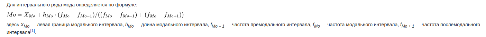

# Вопросы по математическому анализу

1) Интервальные ряды

    https://ru.wikipedia.org/wiki/Мода_(статистика)

    

2) Плотность вероятности

    https://ru.wikipedia.org/wiki/Плотность_вероятности

    
